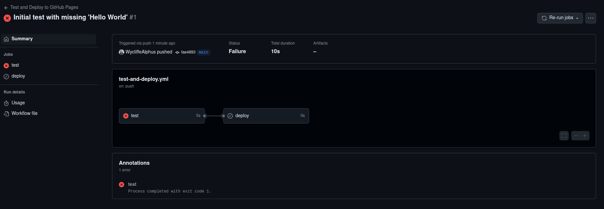
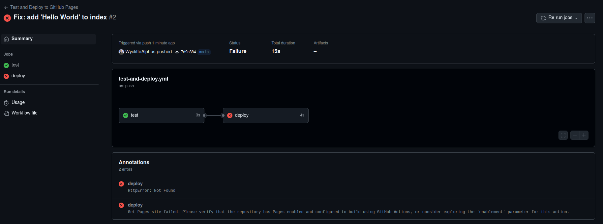
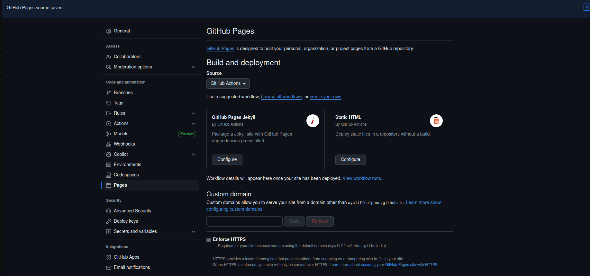
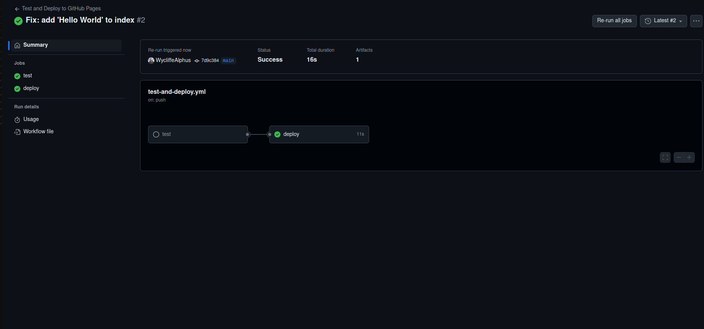
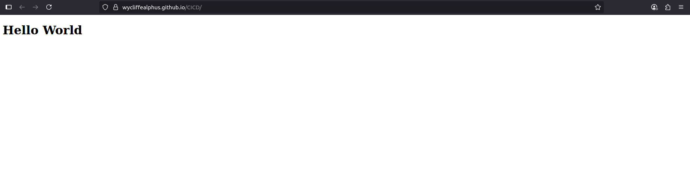

# CI/CD "Hello World" Pipeline

##  Purpose

Set up a minimal CI/CD workflow that:

- Tests the presence of `"Hello World"` in the main HTML file

- Deploys to GitHub Pages only if the test passes

- Demonstrates how automated checks enforce quality before deployment

## Thought Process

DevOps Principles Followed:

- **Automation** -	 Used GitHub Actions to automate build, test, and deploy

- **Quality gates** - 	Required test pass before deployment

- **Transparency** - Logged each step of the process in GitHub Actions

- **Fail fast** -	Deployment blocked immediately if content doesn't match expectations

##  CI/CD Workflow Definition
Added the file `.github/workflows/test-and-deploy.yml` with the workflow definition.

## 🔴 Step 1: Trigger a Failed Deployment

Added a broken index.html (missing "Hello World"):

What happens:

✅ test job runs

❌ It fails because "Hello World" is missing

🚫 deploy job is skipped

## Step 2: Fix the Issue and Deploy 

Note that the test now passes and it gets to the `deploy` job.

However, we get an error meaning that the GitHub Pages is not yet enabled or properly configured to deploy using GitHub Actions.

We fix that in github settings:

Then rerun the job:
`Go to Actions → Click on the failed run → Re-run jobs`

The deployment is now a success.

It can be accessed from this url: **https://wycliffealphus.github.io/CICD/**

